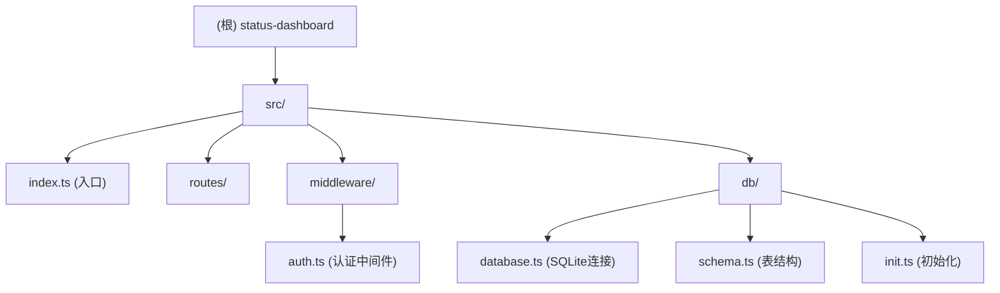

# Status Dashboard

> 项目愿景：基于 Bun + Elysia + TypeScript 的轻量级状态看板后端服务

## 架构总览



## 模块索引

| 模块   | 路径            | 职责                | 入口文件               |
| ------ | --------------- | ------------------- | ---------------------- |
| 主应用 | src/            | Elysia Web 服务器   | src/index.ts           |
| 数据库 | src/db/         | SQLite 连接与表结构 | src/db/database.ts     |
| 认证   | src/middleware/ | AUTH_TOKEN 验证     | src/middleware/auth.ts |

## 运行与开发

### 环境要求

- Bun (latest)
- Node.js (可选)

### 安装依赖

```bash
bun install
```

### 配置环境变量

复制 `.env.example` 到 `.env` 并设置 `AUTH_TOKEN`:

```bash
cp .env.example .env
# 编辑 .env 文件
```

### 启动开发服务器

```bash
bun run dev
```

服务将在 http://localhost:3000 运行。

### 生产启动

```bash
bun run start
```

## 测试策略

当前项目**未配置测试框架**。建议添加：

- 单元测试：Vitest / Bun test
- 集成测试：Supertest (for Elysia)

## 编码规范

- TypeScript strict 模式
- 使用 Bun 原生 SQLite (`bun:sqlite`)
- 路径别名：`@/*` -> `./src/*`

## AI 使用指引

### 常用命令

```bash
# 开发模式
bun run dev

# 类型检查
bun run typecheck  # 需添加脚本

# 运行初始化脚本
bun run src/db/init.ts
```

### 关键文件

- `/Users/jia.xia/development/status-dashboard/src/index.ts` - 主入口
- `/Users/jia.xia/development/status-dashboard/src/middleware/auth.ts` - 认证逻辑
- `/Users/jia.xia/development/status-dashboard/src/db/schema.ts` - 数据模型

## 变更记录 (Changelog)

### 2026-03-19

- 初始化项目文档
- 识别模块：主应用、数据库层、认证中间件
- 覆盖率：7/7 源文件已扫描
